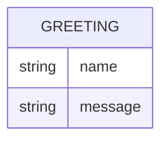

# Domain Model

Greeter's domain is a single, transient concept: the greeting produced for a
requested name. Nothing is persisted — the entity below models the shape of
the response, not a stored record.

- **Greeting** — the name supplied by the caller and the greeting message
built from it. Computed per request; never stored.

